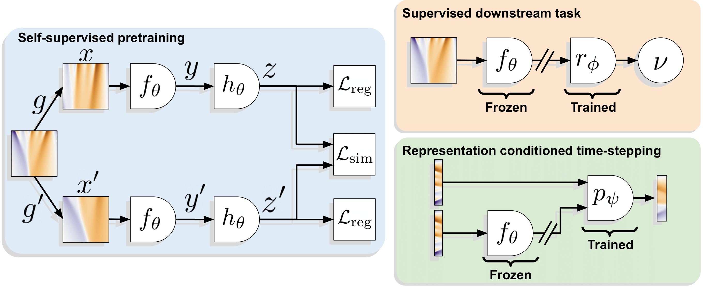

# Self-Supervised Learning with Lie Symmetries for Partial Differential Equations

This repository provides the code for our extension of Self-Supervised Learning to partial differential equations. We provide a sample training code for our pretraining and reproducing our results on buoyancy regression for Navier Stokes as well as the recipe to adapt it to other equations.

The exact principles and experiments are described in our paper [Self-Supervised Learning with Lie Symmetries for Partial Differential Equations](https://arxiv.org/abs/2307.05432) published to NeurIPS 2023.

Grégoire Mialon*, Quentin Garrido*, Hannah Lawrence, Danyal Rehman, Yann LeCun, Bobak Kiani<br>
*: Equal contribution

---



## Data

We rely on the data from [PDE Arena](https://microsoft.github.io/pdearena/) which can be downloaded by following the instructions from [https://microsoft.github.io/pdearena/datadownload/#conditioning-dataset](https://microsoft.github.io/pdearena/datadownload/#conditioning-dataset). Please note that the exact downloading instructions may evolve.

[EDIT]: The PDE Arena website seems to not be online anymore. The data can be accessed at [huggingface.co/datasets/pdearena/NavierStokes-2D-conditoned](https://huggingface.co/datasets/pdearena/NavierStokes-2D-conditoned)

We consider that the data is then stored in `NS_DATA_ROOT` for the remainder of the README.

## Pretraining

We provide the code to reproduce the pretraining on 2d incompressible Navier Stokes.

The code is intended to work in a distributed setting and is made to be used with SLURM compatible clusters. We use submitit to schedule the experiments. An example command to reproduce our results is:
```bash
python navier_stokes.py --logging-folder LOGGING_ROOT -exp-name EXP_NAME --data-root NS_DATA_ROOT
```
Where:
- `LOGGING_ROOT` is the folder where the models and logs will be saved. Tensorboard logs are saved in the `LOGGING_ROOT/runs` folder
- `EXP_NAME` will be the experiment name in `LOGGING_ROOT` and for SLURM.
- `NS_DATA_ROOT` is the folder where the data is stored. It should directly point to where all `h5` files are stored.


Please note that it is possible to run the code without submitit, by simply instantiating the `PDETrainer` class and calling its `train()` function in the `main` function.

For more details on the training arguments, confer the help `python navier_stokes.py -h`. all hyperparameters can be adjusted through command line arguments.


## Evaluation

Evaluation is automatically performed every 10 epochs, and at epoch 0 a supervised baseline is trained .

To only run a supervised baseline, just add `--supervised-only` to the training command. Note that for all supervised results in the paper we adjusted for number of epochs, dataset, and lie point symmetries to give fair comparisons. 

The easiest way to parse the logs is either through the tensorboard logs, or directly by looking at the `LOGGING_ROOT/EXP_NAME/log` file.

In the first line `Loss/baseline_eval_test` gives the test performance of the baseline, and in all lines `Loss/baseline_eval_test` gives the performance of the evaluated SSL model.

## Extending to other equations

The key to extending/reusing our approach relies on the application of the Lie Point Symmetries. For simplicty, we implement them as simple python objects that just require the Lie Trotter implementation (shared) and equation specific transformations (specified in the Lie Algebra). We place the implementation of the LPS transform in the `transformations.py` file.
Once created, it can be used as any function/classical data augmentation.

For example, in the case of Burgers' equation we would have :

```python
class BurgersTransforms:
    @staticmethod
    def group_1(g, t, x, u, a=1, b=1):
        return t + g, x, u

    @staticmethod
    def group_2(g, t, x, u, a=1, b=1):
        return t, x + g, u

    @staticmethod
    def group_3(g, t, x, u, a=1, b=1):
        return t, x, u + g

    @staticmethod
    def group_4(g, t, x, u, a=1, b=1):
        return torch.exp(2 * g) * t, torch.exp(g) * x, u

    @staticmethod
    def group_5(g, t, x, u, a=1, b=1):
        return t, x + 2 * g * a * t, u - g * x - g * g * a * t

    @staticmethod
    def group_6(g, t, x, u, a=1, b=1):
        return t / (1 - 4 * g * a * t), x / (1 - 4 * g * a * t), u - g * x * x // (1 - 4 * g * a * t) + b / a * torch.log(torch.sqrt(1 - 4 * g * a * t))

    def apply(self, gs, t, x, u, order=4, steps=1, **f_args):
        state = lie_trotter_exp(
            (t, x, u),
            [
                BurgersTransforms.group_1,
                BurgersTransforms.group_2,
                BurgersTransforms.group_3,
                BurgersTransforms.group_4,
                BurgersTransforms.group_5,
                BurgersTransforms.group_6,
                ],
            gs,
            order=order,
            T=steps,
            **f_args
            )
        return state[0], state[1], state[2]
```

Here, each transformation gets its own function and should be specified in the Lie Algebra. We can easily see that `group_1` is a time translation for example.

## Requirements

The code relies on:
- Pytorch
- Numpy
- Tensorboard for logging
- tqdm
- h5py
- submitit


## License
See the [LICENSE](./LICENSE) file for details about the license under which this code is made available.


## Citation

If you find this repository or our paper useful, please consider giving a star :star: and citation:

```bibtex
@inproceedings{
mialon2023selfsupervised,
title={Self-Supervised Learning with Lie Symmetries for Partial Differential Equations},
author={Gr{\'e}goire Mialon and Quentin Garrido and Hannah Lawrence and Danyal Rehman and Yann LeCun and Bobak Kiani},
booktitle={Thirty-seventh Conference on Neural Information Processing Systems},
year={2023},
url={https://openreview.net/forum?id=ZULq9QV8rH}
}
```
